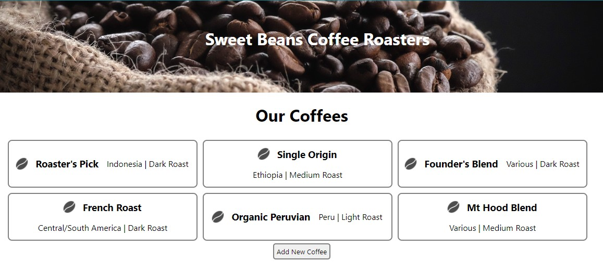
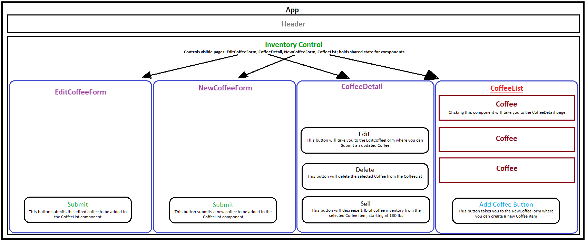

# Sweet Beans Coffee Inventory

### By Dani Steely

#### [Epicodus][Epicodus] project completed during [React][React] curriculum, after chapters on [React Fundamentals][React Fun]. Project is an application in React that tracks inventory for a coffee business.



## Technologies Used:
* _Create-React-App_
* _JSX_
* _CSS_
* _Javascript_
* _React_

## Project Description
This is a React application for tracking and managing inventory for a coffee shop. This application implements full CRUD functionality, and an inventory-tracking capability of sorts. For inventory tracking, each coffee arrives at the roastery in 130 lb burlap sacks-very specific-and the user should be able to press a button the coffee's detail page that decreases the remaining inventory by 1 pound for each press of the button, until the remaining inventory reaches 0.



## Intended User Capabilities:
* to see a list/menu of all available types of coffee beans.
* to see its name, origin, price, and roast of the coffee bean.
* to submit a form to add a new coffee to the inventory
* to be able to click on a coffee to see its detail page
* to see how many pounds of coffee beans are left in inventory
* to be able to click a button to sell a pound of coffee beans. This should decrease the number of pounds left by 1. The number of pounds in a sack of coffee beans should not be able to go below 0

## Known Bugs
* the coffee price initially started as a number, but due to repeated annoying errors, I changed it to a string input. My plan is to correct the input and parse it correctly from a number input to a string in display

## Setup/Installation Requirements

* clone project from github
* from root directory, run:
```npm install```

## Getting Started with Create React App

This project was bootstrapped with [Create React App](https://github.com/facebook/create-react-app).

### Available Scripts

In the project directory, you can run:

#### `npm start`

Runs the app in the development mode.\
Open [http://localhost:3000](http://localhost:3000) to view it in your browser.

The page will reload when you make changes.\
You may also see any lint errors in the console.

#### `npm test`

Launches the test runner in the interactive watch mode.\
See the section about [running tests](https://facebook.github.io/create-react-app/docs/running-tests) for more information.

#### `npm run build`

Builds the app for production to the `build` folder.\
It correctly bundles React in production mode and optimizes the build for the best performance.

The build is minified and the filenames include the hashes.\
Your app is ready to be deployed!

See the section about [deployment](https://facebook.github.io/create-react-app/docs/deployment) for more information.

#### `npm run eject`

**Note: this is a one-way operation. Once you `eject`, you can't go back!**

If you aren't satisfied with the build tool and configuration choices, you can `eject` at any time. This command will remove the single build dependency from your project.

Instead, it will copy all the configuration files and the transitive dependencies (webpack, Babel, ESLint, etc) right into your project so you have full control over them. All of the commands except `eject` will still work, but they will point to the copied scripts so you can tweak them. At this point you're on your own.

You don't have to ever use `eject`. The curated feature set is suitable for small and middle deployments, and you shouldn't feel obligated to use this feature. However we understand that this tool wouldn't be useful if you couldn't customize it when you are ready for it.

### Learn More

You can learn more in the [Create React App documentation](https://facebook.github.io/create-react-app/docs/getting-started).

To learn React, check out the [React documentation](https://reactjs.org/).

### Image Attribution
Photo by <a href="https://unsplash.com/@kittinskie?utm_source=unsplash&utm_medium=referral&utm_content=creditCopyText">Tina Guina</a> on <a href="https://unsplash.com/photos/obV_LM0KjxY?utm_source=unsplash&utm_medium=referral&utm_content=creditCopyText">Unsplash</a>

Bean Icon by <a href="https://commons.wikimedia.org/wiki/File:Antu_application-x-javascript.svg">	Fabián Alexis</a> on <a href="https://github.com/fabianalexisinostroza/Antu">Github</a>
  
## License

_MIT License_

Copyright (c) _6/3/23_ _Dani Steely_

[Epicodus]: https://www.epicodus.com/
[React]: https://www.learnhowtoprogram.com/react-part-time
[React Fun]: https://www.learnhowtoprogram.com/react-part-time/react-fundamentals